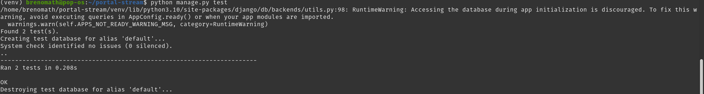

# Portal Stream — Sistema de Vendas (Desafio Técnico SEMEQ)

Sistema de vendas desenvolvido como parte do teste técnico para a vaga de Desenvolvedor.  
O projeto implementa um fluxo completo de e-commerce: catálogo de produtos, carrinho, checkout, autenticação, histórico de pedidos e integração com API externa.

---

## Tecnologias utilizadas

- Python 3.10  
- Django 5.2  
- PostgreSQL  
- Bootstrap 5  
- JavaScript (Fetch API)  
- HTML5 / CSS3  
- API ViaCEP (integração externa)  

---

## Funcionalidades implementadas

### Obrigatórias
- [x] Cadastro e autenticação de usuários  
- [x] Cadastro automático de cliente (Customer) ao criar usuário  
- [x] Listagem de produtos com busca por nome  
- [x] Carrinho de compras baseado em sessão  
- [x] Checkout contendo:
  - Data da venda  
  - Produto(s)  
  - Cliente autenticado  
  - Endereço completo obrigatório  
- [x] Consulta de CEP com API ViaCEP (autopreenchimento de endereço)  
- [x] Histórico de compras por usuário  
- [x] Layout responsivo com Bootstrap  
- [x] Banco de dados PostgreSQL  
- [x] Validação de campos no checkout  

### Extras (Plus)
- [x] Sistema de login e registro completo  
- [x] Proteção de rotas com login obrigatório  
- [x] Testes automatizados (models e views)  
- [x] Interface visual organizada  
- [x] Arquitetura modular com separação por apps  

---

## Como executar o projeto

### 1. Clonar o repositório
```bash
git clone https://github.com/BrenoMatheus/django-sales-system-semeq.git
cd portal-stream
```

### 2. Criar e ativar ambiente virtual
```bash
python -m venv venv
source venv/bin/activate   # Linux / Mac
venv\Scripts\activate      # Windows
```

### 3. Configurar banco PostgreSQL

Crie o banco e o usuário no PostgreSQL:
```bash
CREATE DATABASE portal_stream;
CREATE USER portal_user WITH PASSWORD '123456';

ALTER ROLE portal_user SET client_encoding TO 'utf8';
ALTER ROLE portal_user SET default_transaction_isolation TO 'read committed';
ALTER ROLE portal_user SET timezone TO 'UTC';

GRANT ALL PRIVILEGES ON DATABASE portal_stream TO portal_user;
```

Verifique se em settings.py está configurado assim:
```bash
DATABASES = {
    'default': {
        'ENGINE': 'django.db.backends.postgresql',
        'NAME': 'portal_stream',
        'USER': 'portal_user',
        'PASSWORD': '123456',
        'HOST': 'localhost',
        'PORT': '5432',
    }
}
```

### Setup rápido do ambiente (opcional)

O projeto possui um script automatizado que:

* Reseta o banco
* Aplica migrations
* Cria usuários e produtos de exemplo
* Inicia o servidor

Observação: Na primeira vez que for rodar, é necessário dar permissão de execução ao script:
```bash
chmod +x setup.sh
```

Depois, execute normalmente:
```bash
./setup.sh
```

* Produtos:
    http://127.0.0.1:8000/produtos/

* Login:
    http://127.0.0.1:8000/accounts/login/

* Admin Django:
    http://127.0.0.1:8000/admin

### Rodar manualmente as seeds de dados (dados iniciais automáticos)

Se preferir rodar sem o script setup.sh, execute os comandos abaixo na raiz do projeto (onde está o manage.py):

```bash
# Reseta o banco de dados
python manage.py flush --no-input

# Aplica as migrations
python manage.py migrate

# Cria usuários e produtos de exemplo
python manage.py seed_all

# Inicia o servidor
python manage.py runserver

### Executando os testes automatizados
```

### Usuários de teste

O projeto já possui alguns usuários criados automaticamente pelas seeds (`seed_all`). Use os dados abaixo para login:

| Usuário         | Email              | Senha   | Papel / Permissão |
|-----------------|------------------|--------|-----------------|
| Admin           | admin@exemplo.com | z | cliente   |
| Usuário padrão  | cliente@email.com  | 123456 | Padrão          |
| Vendedor        | seller@exemplo.com | 123456 | Vendedor        |

> * Dica: Para ver todos os usuários criados, você pode rodar:  
> ```bash
> python manage.py shell
> from django.contrib.auth.models import User
> User.objects.all()
> ```


### Executando os testes automatizados
```bash
python manage.py test
```
Exemplo de saída esperada:



Os testes atualmente validam:

* Proteção da rota de histórico (login obrigatório)

* Comportamento básico dos modelos de venda

### Estrutura do projeto
```bash
portal-stream/
│
├── products/      # Produtos e catálogo
├── cart/          # Carrinho de compras (baseado em sessão)
├── sales/         # Vendas, checkout e histórico
├── customers/     # Perfil do cliente vinculado ao User
├── accounts/      # Login, logout e registro
├── templates/     # Templates HTML
├── static/        # JS (ViaCEP), CSS etc
├── config/        # Configurações principais do projeto
```
### Integração com ViaCEP

O sistema utiliza a API pública ViaCEP para preenchimento automático do endereço no checkout:

https://viacep.com.br/ws/{cep}/json/

A integração foi implementada utilizando JavaScript + Fetch API, preenchendo automaticamente:

* Rua
* Bairro
* Cidade
* Estado

### Observações finais
Este projeto foi desenvolvido com foco em:

* Boas práticas com Django
* Organização e legibilidade do código
* Separação por responsabilidade (apps)
* Segurança básica (login obrigatório)
* Experiência do usuário
* Interface visual profissional
* Testes automatizados